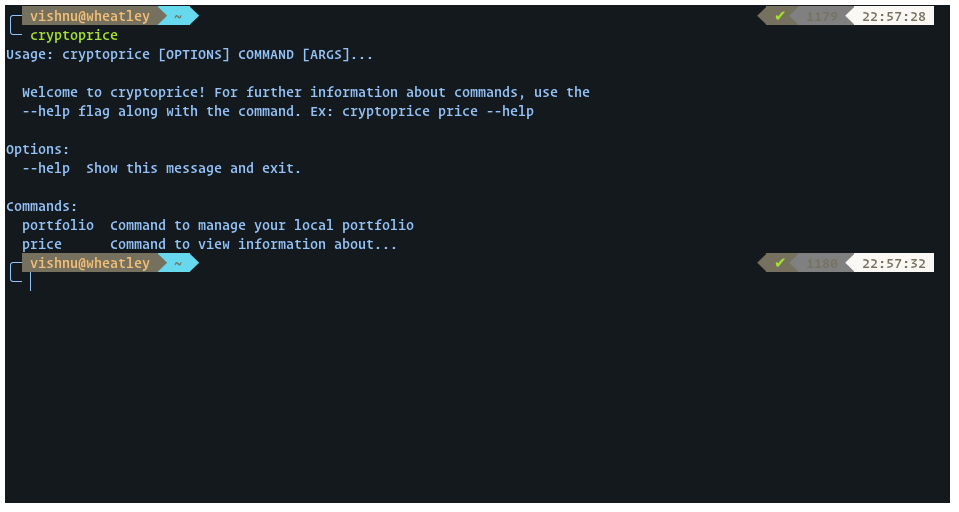
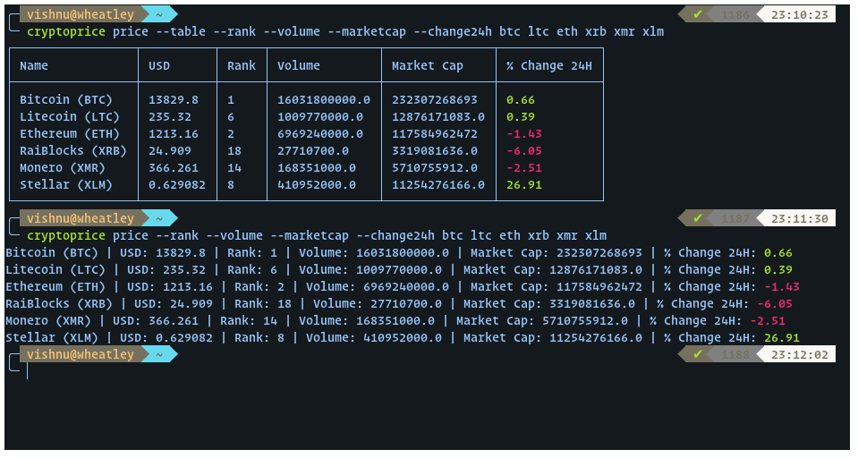

# Table of Contents
- [Table of Contents](#table-of-contents)
- [Introduction](#introduction)
- [Installation](#installation)
- [Commands](#commands)
    - [Price](#price)
    - [Portfolio](#portfolio)

# Introduction

Cryptoprice was created with the intention of making it easy to keep track of your portfolio and monitor the market all in the command line. This project is a work in progress. I will actively work on it and update it with new features. If you have an idea about a feature you would like implemented, please open a new issue.

# Installation

To install using pip, run

```
pip install cryptoprice
```

To install using setuptools, clone the repo, and once inside the repo run
```
python setup.py install
```

Note: It is recommended to install the package using pip rather than setuptools.

Running ```cryptoprice``` should give you this:


# Commands

## Price

The price command lets you access market information about any cryptocurrency.

Options for this command are listed below.

| Option      | Description                                     |
| ----------- | ----------------------------------------------- |
| --nocolor   | Disable colorized output.                       |
| --table     | Show output in a neat table.                    |
| --nousd     | Hide price in USD.                              |
| --btc       | Show price in BTC.                              |
| --rank      | Show coin rank.                                 |
| --all       | Show top 100 coins according to market capital. |
| --volume    | Show volume traded in 24 hours.                 |
| --marketcap | Show coin market capital.                       |
| --change1h  | Show change in the past 1 hour.                 |
| --change24h | Show change in the past 24 hours.               |
| --change7d  | Show change in the past 7 days                  |

The syntax for this command is ```cryptoprice price [options] [coins]```

The image below shows the price command along with some options and some coins. The first command is run with the ```--table``` option, and the second without.



For more help, run the command
```cryptoprice price --help```

## Portfolio

The portfolio command lets you add/remove portfolio transactions and view the status of your portfolio.

Available arguments
| Argument      | Description                                                                        |
| ------------- | ---------------------------------------------------------------------------------- |
| add           | Record a new buy/sell transaction.                                                 |
| remove        | Delete a transaction. You will have to one or a list of transaction IDs to delete. |
| history       | View all transactions.                                                             |
| clear         | Delete all transactions.                                                           |
| *no argument* | Show full portfolio status                                                         |

Options for this command are listed below. These options affect the way portfolio status is displayed.
| Option    | Description                  |
| --------- | ---------------------------- |
| --nocolor | Disable colorized output.    |
| --value   | Show portfolio value in USD. |
| --profit  | Show total profit in USD.    |
| --help    | Show this message and exit.  |

